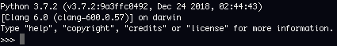

# Which version of Python should I use?
Python 3 was released in 2008 and took an extremely long tine to become the main version of python due to the large amount of code that has been written based on Python 2.  Since Python 2 has not been maintained as of January 1, 2020 any new projects that you start should use Python 3.x+. It is possible that you will work on Python projects that use 2.x.  There are some differences that you need to keep in mind.

**This course requires Python 3.5 or later.**  If you are just installing Python that should not be a problem as the latest version is 3.10.0.  I will be using Python 3.9.5 for the majority of demos.  If you already have Python 3 installed you can check the version of Python with the command `Python3 --version`

Most of the content in this course would work with Python 2.x but there are some significant enough changes between the two that some examples will not work.  Since there is a short amount of time this course will focus on Python 3 only.  There are sme quick hints on Python2 versus 3 below.

# Is it installed already?
1. Open a terminal.
2. run the command `python -V` and note the results.  For Windows system this will most likely give you an error. On Linux and Mac OS X system it will return the version of Python 2.x that is installed on you system.
3. Now try the command `python3 -V` and note the results.  

# Why does `python -V` load version 2.x if you said 3.x is all the rage?
Python 2 is the default due to the wide install base of the language.  Many programs out there are written for Python 2.x.  Switching this default may break scripts that you use and have writing since there are breaking changes between Python 2 and Python 3.  You can read all about the rationale behind this decision in [PEP 394](https://www.python.org/dev/peps/pep-0394/). If you really want to make this change, you can.  However, I would recommend against it,    

# Installing Python
Python is available for download for [Windows](https://www.python.org/downloads/windows/), [Linux/Unix](https://www.python.org/downloads/source/), [Mac OS X](https://www.python.org/downloads/mac-osx/) and [Other](https://www.python.org/download/other/) operating systems.

## Installing on Windows, Linux/Unix, Mac OS X

1. Download the latest python version [[3.10.0](https://www.python.org/downloads/release/python-3100/) | [2.7.18](https://www.python.org/downloads/release/python-2718/)].  If, for some reason you are running an old version Windows, please note that Python 3.5 and later will not run on Windows XP and earlier.

### Using a package manager on linux
On linux systems you can search for available Python packages by using the following commands.

*search for python packages*
    apt-cache search python |  more

*install a particular version*

    sudo apt-get install python2.7

or

    sudo apt-get install python3

or a specifc version

    sudo apt-get install python3.10

### Using docker
If you are running docker a quick way to test something in the Python interactive shell.

    docker run -it --rm --name python-interactive-shell  python:3 python

reference: [Dockerize Python](https://runnable.com/docker/python/dockerize-your-python-application)

## Installing on other operating systems
***Good Luck*** Installation on other operating systems is outside the scope of this tutorial.

Please refer to the [documentation](https://www.python.org/download/other/).  Implementations of Python are also available for AIX, IBm i (aka AS/400), iOS, Solaris, and HP-UX. 

# 

# Take Python for a spin

We can use Python's interactive terminal to give it a quick spin.  **Hello World** has long been the standard to test to see if a development environment is up and running.  Let's try it in python. 

1. From a terminal type `python3` and press enter
2.  You should see something similar to:

    

3. A the >>> type `print('Hello world')` and press the enter key.
4. To quit the interpreter type `quit()` and press enter.

This works because Python is an interpreted language.  Each command sent to the Python interpreter is processed sequentially in the order that it was received.  Ultimately we will want to store our python code in files to help.  

1. From the terminal type `cat > hello_world.py` and press enter.
2. Type type `print('Hello world')` and press the enter key.
3. Press Ctrl-D to save the file.
4. We can now execute the saved script by typing `python3 hello_world` and pressing the enter key.
5.  The phrase "Hello World" should be displayed to the screen.

Each line, all one of them, were executed sequentially before the program exited and we were returned to the command prompt.  

If you got this far, we are ready to start learning Python!

# IDEs
IDEs make it easy to develop and debug python code. You can get by with a plan old text editor but you may want to cosider using an IDE.  An IDE is a personal choice so do not take either of these as an endorsmeent of the product.  They are simply the two that I have been using lately.  My choice has been predicated on that fact that I use Windows, Mac, and Linux computers interchangably and both of these products allow me to stay productive with the same keyboard bindings.  Your milage may vary.  

## Pycharm 
 Pycharm Community Edition is a fee integrated development environment for '*pure Python development*` released by JetBrains.   You can download PyCharm from the [JetBrains website](https://www.jetbrains.com/pycharm/download/).  The website will automatically detect your operating system but you can still chose whether you want to download a version for Windows, MacOs, or Linux.

**Note**: if you are using the Snap package manager on *Ubunto* you can install Pycharm with the following command (all on one line):

    sudo snap install [pycharm-professional|pycharm-community] --classic

**Note**: If you are using Chocolatey on *Windows* you can install PyCharm with the following command (all on one line):

    choco install pycharm-community

## Visual Studio Code
Microsoft already has a great tutorial for [Getting Started with Python on VS Code](https://code.visualstudio.com/docs/python/python-tutorial).  If you would like to use that IDE please follow the istructions in that tutorial.  

# Preparing for the future
Sometimes you wont have a choice to work in Python 3.  Maybe you need to use a library that is only available in Python 2.  For that they have made the [future possible](http://python-future.org/) in Python 2.  This compatibility layer has *future* and *past* packages with forward and back ports of features

That being said, this is a game I suggest you get into only if you need to.

<table>
<tbody>
<tr>
<td>Functionality</td>
<td>Python 2</td>
<td>Python 2 and 3</td>
</tr>
<tr>
<td>Printing</td>
<td>print 'hello'</td>
<td>print('hello')</td>
</tr>
<tr>
<td style="text-align: left;">&nbsp;</td>
<td style="text-align: left;">print 'Hello', 'Saintcon'</td>
<td style="text-align: left;">

from __future__import print_function

print('Hello', 'Saintcon;)

</td>
</tr>
<tr>
<td style="text-align: left;">&nbsp;</td>
<td style="text-align: left;">print &gt;&gt; sys.stderr, 'Hello'</td>
<td style="text-align: left;">

from __future__import print_function

print('Hello', file=sys.stderr)

</td>
</tr>
<tr>
<td style="text-align: left;">&nbsp;</td>
<td style="text-align: left;">print 'Hello',</td>
<td style="text-align: left;">

print('Hello', end='')

</td>
</tr>
<tr>
<td style="text-align: left;">Exceptions</td>
<td style="text-align: left;">raise TypeError, "Something went wrong"</td>
<td style="text-align: left;">

raise (TypeError, "Something went wrong")

</td>
</tr>
<tr>
<td style="text-align: left;">&nbsp;</td>
<td style="text-align: left;">traceback = sys.exc_info()[2] raise ValueError, "Something went wrong", traceback</td>
<td style="text-align: left;">

# Python 3 only: raise ValueError("Something went wrong").with_traceback()

</td>
</tr>
<tr>
<td style="text-align: left;">&nbsp;</td>
<td style="text-align: left;">&nbsp;</td>
<td style="text-align: left;">

# Python 2 and 3: option 1 from six import reraise as raise_ # or from future.utils import raise_

traceback = sys.exc_info()[2] raise_(ValueError, "Something went wrong", traceback)

</td>
</tr>
<tr>
<td style="text-align: left;">&nbsp;</td>
<td style="text-align: left;">&nbsp;</td>
<td style="text-align: left;">

# Python 2 and 3: option 2 from future.utils import raise_with_traceback

raise_with_traceback(ValueError("Something went wrong"))

</td>
</tr>
<tr>
<td style="text-align: left;">Catching Exceptions</td>
<td style="text-align: left;">&nbsp;</td>
<td style="text-align: left;">&nbsp;</td>
</tr>
</tbody>
</table>

## Convert Python 2 to Python 3
The *futurize* script will convert Python 2 into Python 3 code.

## Convert Python 3 to Python 2
The *pasteurize* script will add the appropriate future imports in your code to allow it to run with the Python2 interpreter.