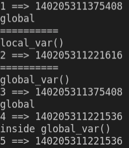

# Welcome

Now it is time to start thing about making our scripts more reusable.  In this module we will look at Functions, Classes, Modules, and Libraries.  We start this journey by understanding Scope and how it affects variables.  

# Scope
Scope is also referred to as namespace.  It is simply a container for mapping names to objects whether they are variables, functions, or classes.  There are four scopes within a Python program: local, enclosing, global, and built-in.  

Scope utlilzes a hierarchical search order when a variable cannot be found in the local scope, the enclosing scope will be searched.  Next, the the global namespace will be searched and finally the built-in scope.  If an object with that name is not found in any scope a NameError exception will be raised.

Modules also provide another level of scope, but more on that later.

## local
Variables that are defined within a function or a class method are local in scope.  Local variables can only be accessed within the function that they are defined in.  If you try to access a local variable outside the scope that it is defined the script will raise a NameError.  ex: NameError: name 'x' is not defined.

## enclosing
Enclosed can be the enclosing function. For instance if a function was defined within another function after t

## global
Variables that are defined outside of a class or function are said to be in the global scope.  They are global to the level of the executing script.

These variables can be access from anywhere.  This sounds powerful but it is a double edged sword.  If the variable is mutable it can also be changed by anywhere as well.  Global variables should be used with caution (or not at all) in any anything beyond trivial scripts. 

## Built-in Scope
These are variables that are predefined in Python.  This scope is where functions such as print() and id() are identified without being imported.

## Putting it all together
Let's take a quick look at how this works by running `python3 local_scope.py` in the terminal and examining the results.


See how the `global` keyword allowed us to change the value in third() while the value in second() was not changed.  This may not work quite the way you expect.  We can use the id() method to look at the memory address that is assigned to a given variable as demonstrated in `variable_ids.py`.  



The output from the id() calls will be will change every time the script is executed but two pairs of values will match.  Line 1 should match line 3 and line 4 should match line 5.  

# Functions
Functions simply allow you to create small reusable sections of code.  They are customizable through the use of parameters and have the ability to return results if desired.  By breaking code into smaller sections complex actions can be reduced to smaller and easier to follow, comprehend  and potentially debug. 

Functions are defined by the _def_ keyword, followed by the name of the function and some parameters and a colon.  In the most basic form you have:

```python
def my_function():
    pass        # the pass keyword is a dummy place holder that can be used if
                # the syntax of a construct requires a statement but no action is desired
```
                    

## Parameters
You can do a lot with functions without taking user input.  However, by adding parameters it becomes possible to make functions dynamic.  Without parameters, functions can only do the exact same thing over and over.

```python
def say_hello(name):
    print(f'Hello {name}!  How are you?')

say_hello('Bob')
```

In other languages parameters are either passed by reference or passed by value.  Python takes another approach and parameters are passed by assignment meaning arguments are passed by automatically assigning objects to local variable names. Everything in Python is an object.  Objects can either be mutable or immutable.  In pass by assignment the mutability of an object matters.  Immutable types cannot be change and mutable types can.   Immutable types include `bool`, `int`, `float`, `tuple`, and `string`.  Examples of mutable types include `list`, `set`, and `dict`.  

```python
# Demonstration of immutability in Python
def func(num):
    num = 7
    print(id(num))          # This will print the same identifier 140405731523368
    print(num)              # This prints 7 since num was assigned 7 previously

x = 5
print(id(x))                # This will print some identifier such as 140405731523368
func(x)
print(x)                     # However, this is still 5 after the function returns 
```    

### Advanced usage of function parameters
Let's quickly look at two more advanced function techniques.

#### Named Parameters (AKA: Optional/Default/Keyword Arguments)

Named parameters can be mixed with positional arguments but the positional arguments must come first.  The power of named parameters is that they provide a way to provide default funcitonality for a function.  Consider the following contrived code.

```python
def exp(value, power = 2):
    return value ** power

print(exp(2))           # This will print 4, the result of 2 raised to the 2nd power
print(exp(2, power=3))  # This will print 8, the result of 2 raised to the 3rd power
```

#### args and kwargs

There is a special syntax that allows you to pass in a variable number of parameters into a python method.  One option is _*args_ and the other is _**kwargs_.  _*args_ allows a variable number of arguments into a method.

```python
def dynamic_args(*args):
    for arg in args:
        print(arg, end = " ")

dynamic_args("Welcome", "To", "Python")
# This will print "Welcome To Python"
```

The other syntax, _**kwargs_ allows for a variable length of key and value pairs which will be passed into the function as a dictionary.

```python
def dynamic_kwargs(**kwargs):
    print(type(kwargs))
    for key, value in kwargs.items():
        print ("%s == %s" % (key, value))

dynamic_kwargs(first ='Welcome', mid ='To', last='Python')

# This will print
# 
# first == Welcome
# mid == To
# last == Python
```

Please note that the names (_*args_ and _**kwarg_) are by convention only.  They can be any valid python variable name.

But wait!  There is more.  if you buy now you can use this format for input as well.  Consider the following code.

```python
def standard_function(arg1, arg2, arg3):
    print(f'arg1: {arg1}\targ2: {arg2}\targ3: {arg3}')

tuple_args = ('Welcome', 'To', 'Python')
dictionary_args = {"arg1": 'Welcome', "arg2": 'To', "arg3": 'Python'}

standard_function(*tuple_args)              # Will print "arg1: Welcome	arg2: To	arg3: Python"
standard_function(**dictionary_args)        # Will print "arg1: Welcome	arg2: To	arg3: Python"
```

The caveat is that in either case it is important that the parameters match.  In the first case, you need to have the exact number of parameters in the iterable that the function expects or you will receive a *TypeError*.  You will also receive a *TypeError* in the keyword variation if the collection contains an unexpected key value or is missing one. 

What if you need to make changes to the values that have come in.  One of the favorite tricks that I learned back in my undergraduate studies is something similar to the following.

```python
x = 5 
y = 6

x = x ^ y
y = x ^ y
x = x ^ y

print(x,y)      # This will print 6 5
```

This neat little trick could be modularized, if integer values were not immutable in python.

```python
# Sadly this will not work the way we want it to since
# integers are immutable in Python
def swap(a, b):
    a = a ^ b
    b = a ^ b
    a = a ^ b
    
x = 5
y = 6

swap(x, y)
print(x,y)      # Rats, x and y are still 5 and 6
```

Since we can't change the input since the integer data type is immutable in python.  We could use globals but I've already warned you about the problems with using global variables so let's take a look at return values and how they can help.   
    
## Return Values
Returning data is as simple as specifying a value using the return keyword proceeding what should be returned.   

Let's take a look with a simple function to sum values:

```python
def sum(a, b):
    return a + b

x = 5
y = 6

print(sum(x,y))             # prints 11
```

The return value can be any valid Python expression.  In actuality, all Python methods without a return statement will return a default value of None.  Let's consider this ill formed Python function

```python
# This method does not behave correctly
def is_even(num):
    if num % 2 == 0: 
        return True

print(is_even(4))           # This will return True which we expect
print(is_even(5))           # This will return None which is probably not what we expect
```

How should we fix this?  We need to make sure that all return paths return a value.  

```python
def is_even(num):
    if num % 2 == 0: 
        return True
    else: 
        return False
```

or a slightly cleaned up version.

```python
def is_even(num):
    return num % 2 == 0
```

In both cases, this will return 

```python
print(is_even(4))           # This will return True 
print(is_even(5))           # This will return False
```

Now we will revisit our swap method thinking about a return value now.

```python
# Okay this version works but 
# we will see it is rather silly
# in a second.
def swap(a, b):
    a = a ^ b
    b = a ^ b
    a = a ^ b

    return a, b

x = 5
y = 6
x, y = swap(x, y)
print(x,y)   
```   

This ability to return multiple results without packaging it in another construct is an interesting aspect of Python.  It is automatically bound into a tuple and you can unpack it on the receiving end.  This is what would have been returned if only one one variable was defined on the left hand side of the function call.

But is there an even better way?  In python yes!  

```python
# Better way
def swap(a, b):
    return b, a

x = 5
y = 6
x, y = swap(x, y)
print(x,y)
```

Considering the capabilities of the language you are using is important for every language.  Python developers even coined a name for it - _pythonic_.  Thinking about these capabilities is very important.  While you are reading you may see non-pythonic examples to illustrate concepts but eventually arive at a pythonic conclusion.

## Generators
There is another method to return multipe

# Classes
A python class is a template for putting together objects within Python.  Object oriented programing is a class all on its own but we should keep well known object oriented principles in mind.  Objects have attributes and functions associated with it.  Classes are defined by the *class* keyword followed by the name of the class and a colon.  By convention, classnames start with an uppercase name.  

```python
class Point:
    x = 0
    y = 0

# instantiating an object
point = Point()

print(point.x, point.y)

point.x = 5
point.y = 7

print(point.x, point.y)
```

The attributes x and y in the `Point` class are actually associated with the class.  Although it is important to note that the class recived that attribute as well.  `Point.x` (as opposed to `point.x`) will still be zero at the end of the preceeding example.

Now we have an object with the ability to set the values for the x and y properties we defined. OO aficionados will scream that this breaks encapsulation.  It is important to remember that classes are mutable in Python.  The concept of private member variables is difficult but not impossible to achieve.  However, that is a discussion for a later [topic](http://www.blog.pythonlibrary.org/2014/01/17/how-to-create-immutable-classes-in-python/).  We can get a little closer to true OO but need to take a deeper look at methods in a class so that we can understand how objects are built in python.

## Methods in class 

We can classify methods in a class as either instance, class, or static methods.  These concepts have been added to python overtime

### Instance methods
Encapsulation is achived by tying attibutes to the instance of the class that they are associated with.  This is accomplished in Python by using the `self` object.  This parameter is passed into methods automatically by the python runtime.  In the code below you can see this magic happen

```python
class Test:
    
    def one(self, x):
        self.x = x

    def two(self):
        print(self.x)

test = Test()
test.one(1)
test.two()      # will print 1
```

This is a step in the right direction.  The only problem is that if `test.two()` was called before `test.one()` it would simply use the default value of `self.x` and print 0.  Provding an automatic point of initalization is where constructures come in.

#### Class Constructors
Adding a constructor to a class is as easy as adding a special instance method with the name of `__init__`.  When a class is instantiated in python this method will automatically be called and will automatically be passed itself as a refects.  We can change the Point class we used before to include a special mehthod to initialize the code.  

```python
class Point:
    def __init__(self, x, y):
        self.x = x
        self.y = y

# instantiating an object
point = Point(2, 3)

print(point.x, point.y)
```

Now if you tried to access `Point.x` or `Point.y` you will received an `AttributeError` as those attributes are no longer defined.

The double underscore prefix and suffix is called a dunder in python and they are typically used for operator overloading.  There are more dunder methods that become impprtant as you increase writing object oriented code in Python.  This is out of scope for todays lesson but can eaily be found if you have created a custom class and are wondering how to perform math on them (examples: \_\_add\_\_, \_\_mul\_\_, etc..), comparision (exales: \_\_eq\_\_, \_\_gt\_\_, etc...), or size (\_\_len\_\_).

### Class methods
Class methods are tied to the instance of a class.  To accomplish this they recieve a parameter of type `cls`.  At the simplist level you can walk through the following code.

```python
class Fruit:
    name = 'Fruits'

    def printName(cls):
        print('the name of the class is: ', cls.name)

class NotFruit:
    name = 'Not a Fruit'


Fruit.printName(Fruit)      # prints Fruits
Fruit.printName(NotFruit)   # prints Not a Fruit
```

The intent of a class method if for the method to work with the class it is assoicated.  As can be seen above this is not the case.  There is a special syntax that to make this more explicit.

```python
class Fruit:
    name = 'Fruits'

    @classmethod
    def printName(cls):
        print('the name of the class is: ', cls.name)

class NotFruit:
    name = 'Not a Fruit'


Fruit.printName()      # prints Fruits
Fruit.printName(NotFruit)   # Throws a type error as an extra parameter was passed
```
The `@classname` has syntax we have not discussed before.  That @ symbol defines a decorator.  Decorators are covered in [Module 08](../Module&#32;08/readme.md) 


### Static methods
Static methods are tied to the class that they are associated with but do not have access to the class or an instance of the class.  They are defined with the `@staticmethod` decorator similarily to class methods above.   Static methods have an interesting place in python as they are intened to perform essentially that same thing as modules - Group together similar functionality.  The benefit of the static method in this case is that it is associated with the class and not another module.  However, from an OO perspective it is possible that the static methods should belong to another class. 

The last major concept for classes is inhertiance which allows children classes to inherit functionality from their parent.  

```python
class Person:
  def __init__(self, fname, lname):
    self.firstname = fname
    self.lastname = lname

  def details(self):
    print(self.firstname, self.lastname)

class Student(Person):
    def __init__(self, fname, lname, school):
        super().__init__(fname, lname)
        self.school = school

student = Student("Maria", "Jones", "Harvard University")
student.details()     # Will print Maria Jones

```

In the example above you can see that the student object which is derived (inherits) from Person extending the student object to have the atributes (firstname, lastname) and methods (printname). Quickly examining the `__init__` method to see another new keyword `super`.  This provides a way share common functionality. 

Extending the base class is one of the benefits of inheritance.  If we add the following method to the Student class we change the behavior for students.

```python
    def details(self):
        print(f"{self.firstname} {self.lastname} is a student at {self.school}")
```

This would make the call to `student.details()` print "Maria Jones is a student at Harvard University" instead.  Two methods exists that provide information regarding the relationship between an object.  You can use `issubclass()` and `isinstance()` to find out.

```python
print(issubclass(Student, Person))      # Prints True
print(issubclass(Person, Student))      # Prints False

print(isinstance(student, Person))      # Prints True
print(isinstance(student, Student))     # Prints True
```

# Modules
## Basics
A python module allows you to organize Python code.  The libraries that imported in the global namespace are [python modules](https://docs.python.org/3/py-modindex.html).  To include a modlule you use the `import` statement.

``` python
import math
print('The value of pi is ', math.pi)
#  Output:  The value of pi is  3.141592653589793
```

There are a couple of more tricks with importing that you should know.

```python
# rename a module
import math as m
print('The value of pi is ', m.pi)

```

```python
# import multiple parts of a module
from math import pi, e
print('The value of pi is ', pi)
print('The value of e is ', e)
```

_Note:_ You can use the * as a wildcard to pull in everything but it is a bad programming practive and you should not do that.

Python are imported using a search path.
- The current directory
- The `PYTHONPATH` enivronment variable
- The installation path

All of these can be seen in python by querying `sys.path` from the `sys` module.  `sys.path` can be ammended but you should really consider this for anything besides non-trivial scripts.

## Custom modules
And you already know how to make your own Python module.  It is any file that contains Python code, whether it be script, function, class or combination thereof.  A python module is defined by the name of the module and its .py extension.  For example, the module Saintcon would be in the file `saintcon.py`.  To use the module you need to the import statement.  

Let's create a file named `sequences.py`

```python
def fibonacci(n): 
    a = 0
    b = 1
    if n < 0: 
        print("Incorrect input") 
    elif n == 0: 
        return a 
    elif n == 1: 
        return b 
    else: 
        for i in range(2,n): 
            c = a + b 
            a = b 
            b = c 
        return b 

def squares(n):
    return n**n


def triangles(n):
    return n(n +1)/2
```

We can test this module with another file.

```python
import sequences

print('Fibonacci\n')
for x in range(10):
    print(x, sequences.fibonacci(x))

print("Squares\n")
for x in range(10):
    print(x, sequences.squares(x))

print("Triangles\n")
for x in range(10):
    print(x, sequences.triangles(x))
```

Custom modules provide the abiltiy for you to define code that you want to resuse in various scripts.

# Packages
A python package is simply a directory holding subpackages and modules.  This are what are typically downloaded from [PyPI](https://pypi.org/) using `pip` or similar tools.

A package must comntain a `__init__.py` file.  The purpose of this file is to permit initialization code that is run when the package is loaded.  In the simplist case this file can be empty but it is commonly used to import that modules that exist in the package. 