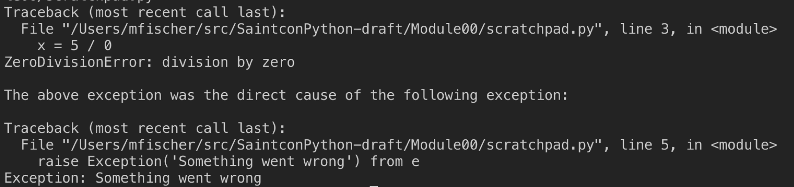

# Error and Exceptions
Unlike other languages the terms error and excception are interchangable in python. In python all exceptions derive from `BaseException` and can be seen in the [Exception Hierarchy](https://docs.python.org/3/library/exceptions.html#exception-hierarchy). Generally there are compile time errors and runtime errors. 

A good Integrated Development Environment (IDE) will help identify compile time errors in python during the development process.    The errors that an IDE helps catch at design time include: `ImportError`,  `IndentationError`,  `NameError`,  `NotImplementedError`, `SyntaxError`, `TabError`, `UnboundLocalError`.  The most likely error that you will see in Python is `SyntaxError`.  `SyntaxErrors` occur when developing and introducing typos that confound the interperter.  These are the  compile time errors.

On the other hand you can have runtime exceptions.  When these occur they can be dectected, providing the opportunity to recover or at least gracefully exit the program.  Exception handling in Python is more verbose than you might have seen in other languages with the addition of an optional else clause that is executed if no exception occurred during the *try* block.  The format of the *try* block is fairly simple.

```python 
# example of the python exception handling construct
try:
    # execute some code that could raise an exception
except:
    # this code is executed if an exception occurs
    pass
else:
    # this code is executed if the try block is executed without exception
    pass
finally:
    # this code is executed after the try block, any exception block OR the else block
    pass
```

Rumor has it that the purpose of the else clause is that exception handling is more common in Python than other languages.  It does make the code a little easier as the code in the else would otherwise need to be included in the try block after whatever line could have caused an exception.

It is also possible to *raise* an exception to signify that an exceptional condition has occurred. This allows the developer to control the flow of the program if necessary. Raising Exceptions have changed between Python 2 and 3 so we will only see the syntax for Python 3.  

```python
# demo of raising an exception
raise Exception('This is my exception')

# Will produce the following Traceback - aka StackTrace
# Traceback (most recent call last):
#  File "scratch.py", line 1, in <module>
#    raise Exception('This is my exception')
#Exception: This is my exception
```

One thing that you want to be careful about is hiding important details from an error.  The following will allow you to keep visibility into the original issue.

```python
# demo of raising an exception
try:
    x = 5 / 0
except Exception as e:
    print('something went wrong: \n' + str(e))
finally:
    print('we made it to the end')
```

In addition, starting with Python 3 you can have Exception chaining.

```python
# demo of raising an exception
try:
    x = 5 / 0
except Exception as e:
    raise Exception('Something went wrong') from e
```

The Traceback changes a little when exceptions are chained.



## Creating your own Exception class to raise.

Creating a custom exception is a simple a deriving from the `Exception` class.  Exceptions can be `raise`d from within code.

```python
class CustomException(Exception):
    def __init__(self, message):
        super().__init__(message)

raise CustomeException("This is my customer exception")

```
## Exceptions Groups
New to `Python 3.11` is the concept of exceptions groups.  Exception Groups give you the ability to raise multiple exceptions at the same time.  Using a modified syntax it is possible to catch both of the exceptions to execute multple paths of code.

```python
def raise_exception_group():
    raise ExceptionGroup(
        "Description from ExceptionGroup", # Group wrapper
        [
            ValueError("ValueError"), # First exception in group
            TypeError("TypeError") # Second exception in group
        ]
    )


def main():
    try:
        raise_exception_group()
    except* ValueError:
        print("Value Error!")
    except* TypeError:
        print("Type Error!")

```
In the preceding example both `Value Error!` and `Type Error!` would be displayed.  This is possible due to the `ExceptionGroup()` that was raised and the `except*` syntax.

## Exceptions Notes
Also new to `Python 3.11` is the ability to add a note to an exception that is thrown.  This allows you to add additional context to an excpetion that was caught and add more details to the traceback.

```python
def raise_exception():
    raise Exception("An Error occured")


def main():
    try:
        raise_exception()
    except Exception as ex:
        ex.add_note("add_note is a new method that will add addtional context to your exception") 
        raise

main()
```