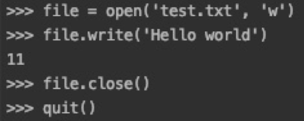
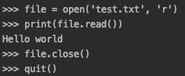
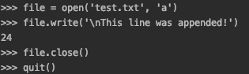
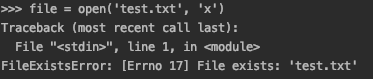

# File Access

Working with files is one of the prime usages for Python scripts. It is important to have a good understanding of how to perform operations with files.  You can easily read, write, create, and delete files in Python.

While we we will see other options later, this section will deal with the basic operations built into the standard library - working with files using open().  Open will return a File object. The format for open is *open(filename[, mode[, buffering]])*.  If the file cannot be opened it will return an IOError. 

filename - the name of the file to open

mode - how to open the file for processing

|mode|details|
|-|-|
|r|Opens the file for reading|
|w|Opens the file for writing.  If the file does not exist a new one will be created.  If the file exists it will be truncated|
|a|Opens the file for appending. |
|b|Opens the file in binary mode.|
|x| Opens the file for writing.  Throws an exception if the file already exists|
|+|Opens a file for reading and writing

These modes can be combined together.  For example 'rb' will open a file for reading in binary mode.  'w+b' will open a binary file for reading and writing.

buffering - Specifies the desired buffer size.  
|mode|details|
|-|-|
|Negative number|Use the system default|
|0|Unbuffered|
|1|Line buffered|
|Positive Number|Use of buffer of approximately n bytes|

## Write a file


Once you have exited the Python terminal you can see that there is new file that has been created as test.txt.  if you run `cat test.txt` you can see that there is no new line added to the line.  There are a couple of ways to add this to the file if necessary.  The first is the add '\n' to indicate a new line. Another way is to use the `readlines()` which will take list of strings and write each item to the file one item after another with new lines.

## Read a file


Reading a file is pretty simple as well.

## Append to a file


In the example above we added a new line to the end of the existing line while adding some more text.

## Create a file
Maybe you were not paying attention earlier during the write example.  It created the file if it did not exist or truncated it if it did.  However, there is another mode that will error if we try to use a file that already existed.  




## NOTE: closing files
All the examples have shown an explicit call to `close()` but there is an easier way that will close the file automatically for us.  The following code is a rewrite of the first file write example.

```Python
with open('test.txt', 'w') as f:
    f.write('Hello world')
```

Once the code finishes the with block the You make ask why it is important to close files when you are done with them.  Some implementations of Python will automatically close files when their reference count drops to zero.  However, you are not guaranteed.  

## Working with Files
The Python standard library contains a module that makes it eas to manipulate files.   From the `shutiil` model we can copy, move or delete files and folders.  Let''s take a look at some of the things we can do using this module in conjneciton  with the `os` module.

For copying files `shutil` provides 2 similar methods; `copy()`, `copy2()`, and `copyfile()`.  The difference between `copy()` and `copy2()` is that `copy2()` will try to preserve then file metadata such as timestamps.  `copyfile()` will only copy files if the target destination is writable.  If it is not writable an IOError will be thrown.  `copyfile()` will also throw an error if the target is a directory.  Internally these files make use of an `copyfileobj()` method which is also available. Note, using `copyfileobj()` will require that the programmer explicitly calls close if the destination was a file object

```Python
# - The `os` module provide assess to 
# - The `shutil` module provides access to methods that allow 

# Useful method in shutil
import os, shutil

# create a ddirectory
cur_dir = os.getcwd()
# prints the current working directory
print(cur_dir)          
path = './test'
os.mkdir(path)
os.chdir(path)
# we should now be in the new directory
print(os.getcwd())          
```

# JSON 
JSON has become the defaco file format for wokring with data within python.  It would be remiss not to demonstrate how easy to work with json data files.  [Api.weather.gov](https://www.weather.gov/documentation/services-web-api#/) provides an API that can be used to request weather related data for various regions.  Using the requests API it is possible to pull back data sepecifc to the Utah Valley Convention Center.  The full return value can be seen in [data.json](data.json).

```python
import json

with open('data.json') as json_file:
    data = json.load(json_file)

# print temperatures
for temp in data['properties']['temperature']['values']:
    print(temp['validTime'], temp['value'])


    # Partial Output
    # 2021-10-24T07:00:00+00:00/PT3H 7.777777777777778
    # 2021-10-24T10:00:00+00:00/PT2H 7.222222222222222
    # 2021-10-24T12:00:00+00:00/PT1H 6.666666666666667
    # 2021-10-24T13:00:00+00:00/PT2H 6.111111111111111
    # 2021-10-24T15:00:00+00:00/PT1H 6.666666666666667
    # 2021-10-24T16:00:00+00:00/PT1H 7.777777777777778
    # 2021-10-24T17:00:00+00:00/PT1H 9.444444444444445
    # 2021-10-24T18:00:00+00:00/PT1H 11.11111111111111
    # 2021-10-24T19:00:00+00:00/PT1H 12.222222222222221
    # 2021-10-24T20:00:00+00:00/PT1H 12.777777777777779
    # 2021-10-24T21:00:00+00:00/PT4H 13.333333333333334
```

