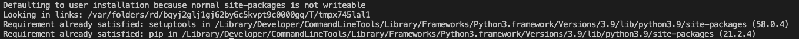

# PIP and Venv

Everything we have seen before now has used the Python standard library.  But to really harness the power of Python we need to look at the vast library of support and infrastructure that exists for Python.  To make the best use of this infrastructure lets talk quickly about pip and venv.  Both of these tools have been baked into recent versions of Python.

# PIP
Pip stands for Pip Installs Packages.  It is Python's official sanctioned package manager.  By default it can be used to install packages installed on the Python Package Index (PyPI).

The documentation for pip can be found [online](https://pip.pypa.io/en/stable/).

Pip is installed by default in Python 3.4+. However, you can verify that it is installed by running `python3 -m ensurepip --default-pip` which will return something similar to the following:

## Common pip commands

`pip --version` - lists the version of pip

`pip install -U pip` - Upgrade pip to the latest version

`pip list` - shows what packages are installed on the system

`pip list --outdated` - shows the package, the version installed, the latest version available, and the type of distribution.  The distribution type will be either *standard* (egg), a source code package, or *wheel*, a binary distribution.

`pip install *package*` - installs a package

`pip install --upgrade *package*` - upgrades a package 

`pip uninstall *package*` - removes a package

`pip search *text*` - Searches PyPi for the packages related to the specified text.

`pip show *package*` - shows information about a particular package.

A couple of extra useful commands include being able to prepare an environment.    The following commands will generate a file and then use that file to install pip on another system.

`pip freeze > requirements.txt` - generates a file of installed packages in a case-insensitive sort order.

`pip install -r requirements.txt` - installs the packages listed in the supplied requirements file. 

**Note**

It is also possible to run all of the previous commands through the Python3 executable by adding '`python3 -m `' to the beginning of the command. 

# venv
Venv is a tool that is used to create virtual environments.  But what does that mean?  A virtual environment is a self-contained directory tree which an installation of Python and supporting packages.  It is the successor to a tool called virtualenv.  

What are some of the benefits for using a virtual environment?

- Consider the potential for breaking changes for other scripts executing on the system.
- Consider the need to execute the Python script on a build system or customer system that you want to be the same after it is done.

## common venv commands

`python3 -m venv *dir-name*` - Creates a directory tree in dir-name with a copy of the python interpreter, the standard library and supporting files.

Once the directory is created it must be activated.

### linux/macOS
`source tutorial-env/bin/activate`

if you are not using bash you can use csh (activate.csh) or fish (activate.fish) as well.

### Windows
`tutorial-env/bin/activate.bat`

## deactivate 
When your are done it must be deactivated by using the `deactivate` command.    