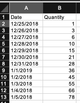

# Office Documents 

Sometimes it is useful to be able to read and write office files.  Most commonly it is necessary to either generate Excel or Word documents for reporting purposes.  When sending data between applications it is still better to stick to text based formats such as CSV or JSON.  However, when you need to prepare material for a presentation sometimes text just doe not cut it. It is up to you, as the developer, to decide how much formatting and tweaking needs to be done. 

## Writing Excel Files
Writing an excel file is simple with the xlwt library.  First it is necessary to import the xlwt library from PyPI with the following command from the command line.

    pip install xlwt

The steps for creating an Excel spreadsheet are fairly straight forward.

1. create a workbook
2. add a new sheet
3. write data to the sheet
4. repeat steps 2-3 as necessary
5. save the workbook.

To see this in action let's examine the following script which will create a workbook with a single sheet and a table full of data.

```python
import xlwt

headers = ['Date', 'Quantity']
data = {
    '12/25/2018': 1,
    '12/26/2018': 3,
    '12/27/2018': 6,
    '12/28/2018': 10,
    '12/29/2018': 15,
    '12/30/2018': 21,
    '12/31/2018': 28,
    '1/1/2019': 36,
    '1/2/2018': 45,
    '1/3/2018': 55,
    '1/4/2018': 66,
    '1/5/2018': 78,
}

new_book = xlwt.Workbook()
new_sheet = new_book.add_sheet('Saintcon')

row = 0
col = 0
line = new_sheet.row(row)
for header in headers:
    line.write(col, header)
    col +=1

row += 1
for d in data:
    line = new_sheet.row(row)
    line.write(0, d)
    line.write(1, data[d])
    row += 1

new_book.save('saintcon.xls')
```

Run the script and open the resulting XLS file.  You will see output that should like the same as below.



This seems a little bit too manual.  Lets see if we can optimize it.

``` python
import xlwt
import datetime

headers = ['Date', 'Quantity']
date = datetime.datetime(2018, 12, 25)

new_book = xlwt.Workbook()
new_sheet = new_book.add_sheet('Saintcon')

date_format = xlwt.XFStyle()
date_format.num_format_str = 'yyyy-MM-dd'

row = 0
col = 0
line = new_sheet.row(row)
for header in headers:
    line.write(col, header)
    col +=1

for day in range(12):
    row += 1
    line = new_sheet.row(row)
    line.write(0, date, date_format)
    if row == 1:
        line.write(1, row)
    else: 
        formula = 'B{} + {}'.format(row, row)
        line.write(1, xlwt.Formula(formula))
    date = date + datetime.timedelta(days=1)

new_book.save('saintcon.xls')
```

## Reading Excel File
Excel files that have heavy formatting are difficult to read and our beyond the scope of this tutorial.  However, excel files that are written in the simplified version of our first example can be easily read.

```python
import xlrd

file = 'saintcon.xls'
book = xlrd.open_workbook(file)
sheet = book.sheet_by_name('Saintcon')

print('there are {} rows with {} columns'.format(sheet.nrows, sheet.ncols))

for r in range(sheet.nrows):
    for c in range(sheet.ncols):
        print("'{}'\t".format(sheet.cell(r, c).value, end = '')),
        # print("'{}'\t".format(sheet.cell(r, c).ctype, end = '')),
    print("")
```


## Writing to a Word Document
For this one we need to cheat a little bit as I have not seen the need to create a completely new word document from scratch.  However, it is realitvely easy to use a preexisting word document and the mail merge functionality to create a report.  You can review our preexisting [template](Remediation&#32;Report&#32;Template.docx).

[Mail merge example](mail_merge.py)
```python
from mailmerge import MailMerge

template = "office/Remediation Report Template.docx"
outfile = "test.docx"

document = MailMerge(template)
print(document.get_merge_fields())

findings = [{
    'FindingSeverity': 'Severe',
    'FindingStatus': 'Open',
    'FindingId': '1234',
    'FindingText': 'blah'
},

{
    'FindingSeverity': 'Medium',
    'FindingStatus': 'Open',
    'FindingId': '1234',
    'FindingText': 'blah blah'
},

{
    'FindingSeverity': 'Low',
    'FindingStatus': 'Open',
    'FindingId': '1234',
    'FindingText': 'neh'
}
]

document.merge(ReportDate='2019/10/31', BLA_DATE='2018/05/19', ProductName='My test')
document.merge_rows('FindingId', findings)
document.write(outfile)
```