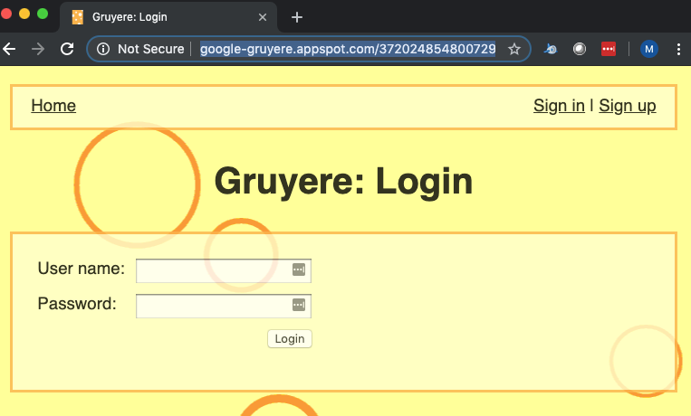
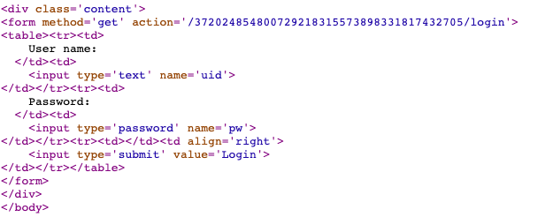

# Requests
There are many ways to work with websites on the internet.  Built into the python standard library is the [httplib](https://docs.python.org/2/library/httplib.html) and [urllib](https://docs.python.org/2/library/urllib.html).  These libraries have their place but by far the easiest is the [requests](http://docs.python-requests.org/en/master/) class.  The `requests` objects needs to installed from PyPi.  From the command line type `pip install requests`.  This library is a simple and intuitive framework for making web requests.

For unauthenticated public website it is extremely simple to get the content that exists. 

```python
import requests

request = requests.get('https://www.google.com/')
if request.status_code == 200:
    print(request.content)          
    # Will print the html for the google homepage
```

The preceding snippet if fairly straight forward.  First the requests library is imported.  Next, `get()` is called on the requests object for the home page. If the result of the call has an http status code of 200 (OK) then whatever was retrieved frmo the page and stored in the contents wwill be printed.  And yes, it would have been better (more readable) to replace the magic number 200 with `requests.codes.ok` but sadly most of the scripts that I have looked at default to the numerical code.  

You may learn new information by looking at the [requests source code](https://github.com/psf/requests/blob/master/requests/status_codes.py) or by playing with the API.  Take your time and find my favorite status code.

```python
import requests
print(requests.status_codes._codes[418])
```

In this case the content was HTML but the content can be varied.  Some times it will be text, html, json, or similar.  Sometime it might be binary data.  You can find out a great detail about the type of data in the request by looking at the request headers.  We will modify our previous example to return a dilbert cartoon from dilbert.com.  

```python
import requests

# image copy right Scot Adams
request = requests.get('https://assets.amuniversal.com/7f7ed250c7460137c2df005056a9545d')
if request.status_code == 200:
    for header in request.headers:
        print(f"{header}: {request.headers[header]}")
        # See table in wiki for what this prints

    print(request.content[:20])
    # prints the first 20 bytes of the content
    #   b'GIF89a\x84\x03\x18\x01\xf7\x00\x00\x01\x01\x02\x05\x05\x08\x07'
```

Since I did not get permission to reuse this content I am not saving a copy.  These email only shows the begging portion of it.  Pleast take a look where it is [hosted](https://tinyurl.com/4u3syv65) if you are interested.  All copyrights belong to the owner.

The final line in the snippet prints the first 20 bytes of the file.  Which we can see at least conform to the specification for the beginning of a GIF file.  For the headers the snipper above will return the following headers:

|Header|Value|
|-|-|
|Date | Sat, 19 Oct 2019 02:28:37 GMT|
|Content-Type | image/gif |
|Transfer-Encoding  | chunked |
|Connection | keep-alive |
|Server | PWS/8.3.1.0.8 |
|Content-Disposition | inline; filename="dt191018.gif" |
|Content-Transfer-Encoding | binary |
|X-XSS-Protection | 1; mode=block|
|X-Content-Type-Options | nosniff|
|X-Request-Id | 68459d4f-bde8-40a4-8093-416651fb9b6d |
|ETag  | W/"89fb2dc2abbb245ceaee0be0e3542c71"|
|Status |  200 OK|
|Age | 52259|
|Via | 1.1 PSmgbsdBOS1xt88:6 (W), 1.1 PSmgasbIAD1us80:10 (W)|
|X-Px |  ht PSmgasbIAD1us80IAD|
|Cache-Control |  max-age=604800|

As you can see the header information can provide information about the type of image (Content-Type) and the file name (Content-Disposition).

So far, we have see a simple get.  Requests in intuitive in how it works.  There is a method for each common HTTP verb.  Presently these are `get`, `head`, `post`, `put`, `delete`, and `options`.  Some that are missing include the verbs CONNECT and TRACE.  When a verb you need to use is not supported (or you want to do things the hard way) you can use the `request()` method to accomplish the same thing.  As seen by going back to our first example

```python
import requests

request = requests.request('GET', url='https://www.google.com/')
if request.status_code == 200:
    print(request.content)          
    # Will print the html for the google homepage
```

## Sessions
The above is great when you are dealing with the stateless nature of the internet.  But sometimes you need to be able to maintain a session.  This is possible using `requests.session` and we will take a look at it using the [Google Gruyere](https://google-gruyere.appspot.com/) website. An intentionally vulnerable website.  After a session is spun up you can visit the (login page)[http://google-gruyere.appspot.com/372024854800729218315573898331817432705/login] for it.  *Note to self - hopefully our session has not expired*



Logging into an instance is done through a login page.  The HTML form for this provides all the details that we need to be able to login through python.  As can be seen in the form the page is going to do GET to the login page and require a uid text field and a pw password field.



Hopefully as information security professionals you have noticed one of the flaws in this insecure web application.  But that is beside the point of this course.  We will use it is it is and demonstrate how to log into this website.  

```python
import requests

session_id = '372024854800729218315573898331817432705'
url_base = 'http://google-gruyere.appspot.com/{}/{}'
sign_in_page = 'login'

# bad part of our script but probably okay since these aren't our
username = 'test'
passwords_to_try = ['password', 'not_the_password', 'test']

session = requests.session()

for password in passwords_to_try:
    login_url = url_base.format(session_id, sign_in_page)
    login_url += '?uid={}&pw={}'.format(username, password)

    print('trying password: ' + password + " .....", end = ' ')
    result = session.get(login_url)

    if result.status_code == requests.codes.ok:
        # well unfortunately a login failure retuns OK too
        if "Invalid user name or password." in result.text:
            print('FAILED!!!')
        else:
            print('We found the password - ', password)
    else:
        print(result.status_code)
```

Execution of this script will result in the following output:


This is one of the interesting things about working with the web.  We have a nonstandard version of login with nonstandard results.  The results of calling the login form with the incorrect password still returns a 200 OK.   Looking at the resulting output you can see that login is successful if the result of the request returns the title 'Gruyere: Home' instead of 'Gruyere: Login'.  Observing this makes a perfect example of how customization may be necessary in scripts.  Some thought needs to be given to how to process the script.  Examples of what might need to be done include:

- Parsing the resulting content as in above
- Inspecting the return headers 
  - Session Token
  - Status code
  - Redirect to authenticated url
- Inspecting the cookies to see if a session token was successfully generated
- And more

## Proxies
Sometimes you may want to route your requests through a proxy.  Whether this is because the organization you are at requires it or because you want to observe the interactions through an intercepting proxy such as [Burp Suite](https://portswigger.net/burp) it is good to know that this is easily accomplished.

The behavior is slightly different between using requests and using the sessions object.  Using the methods that correlate to the HTTP verbs the proxy is passed as a named parameter to the request method.  For the session you set a property on the session that was created and it is automatically applied to all request.  

An example is below but before we get started with an intercepting proxy we need to have to have a conversation about validating self signed certificates.  If you try to use an intercepting proxy you will encounter an SSLError for having a self signed certificate in certificate chain. Another named parameter exists named verify to specify how to validate.

```python
# setup proxy dictionary to point to local host.
proxy = {}
proxy['http'] = 'http://localhost:8080'
proxy['https'] = 'https://localhost:8080'

# set on session object
session = requests.session()
session.proxies = proxy

# example using request
url = 'https://www.gooogle.com'
requests.get(url, proxies = proxy, verify = 'path_to_pem_file')
```

*Note:* If you are familiar with Burp you may recall the the certificate that you can download is cacert.der.  This would need to be converted into a [pem file](burp_certificate.md).

*Note:* If the above note seems like a bit much, you can handle the situation the same way that 90% of the internet does.  Simply set verify equal to False to disable certificate validation.  Although I would recommend against it for all but the simplest solutions.

## Manipulating headers
You may find that it is necessary to add custom headers to your solution.  Some examples as to why this may be necessary include to add a session token to hijack another session, introduce an API key, or perhaps to work around web sites that check the user agent string.  By default, the user agent string for is the version of the Python Requests library being used.  For example, while writing this it was 'python-requests/2.26.0'.   

Some websites use the agent string to verify or block out robots. You can find a list of users agent strings [online](https://developers.whatismybrowser.com/useragents/explore/).  Or, if you frequent SaintCon and participate in the precon challenges you may recall the fist one from SaintCon 2019 which was well suited for python.

 

If you  you had to come up with a way to make a change to the user agent ot find the right key. The requests library makes this really simple to accomplish.

```Python
import requests

url = 'https://precon.hackerschallenge.org/p1-z/'
header = {'User-Agent': 'SAINTCON'}

result = requests.get(url, headers = header)
print(result.content[802:1042])

# the results from this query.
# SOLVED
# <p>Slack <em>@PreCON Hackers Challenge</em> <a href=slack://user?team=T7AH2BQJE&id=UNM0ZMSSF>here</a> or <a href=https://app.slack.com/client/T7AH2BQJE/DNKMR9B5Y/user_profile/UNM0ZMSSF>here</a>, with the keyword: <pre>#########</pre>
```

## Thinking about APIs
We have talked about using requests for accessing web sites.  However, the power of requests can be used on APIs just as well.  All that is necessary to access APIs is to use what we have learned above to capture the data from an API and to process the data in response.content.  As with websites there may be some thought needed for accessing an API.  If it is a public API there will be documentation.  You can, and I do, use them for undocumented APIs as well it typically requires a significant amount of time in either Burp or Developer Tools.

# JSON
We will not return to our JSON example from [Module 9](../Module%2009%20-%20Working%20with%20Files%2Freadme.md).  Now we will look at the script that retrieved the data the we looked at. All the data was retrieved came from about 5 lines of code.

```python
import requests
import json

weather_url = "https://api.weather.gov/gridpoints/SLC/104,150"

headers = {
    'accept': "application/json",
    }

response = requests.request("GET", weather_url, headers=headers)
data = response.json()

# Here is the code that wrote out the data file
with open('data.json', 'w') as outfile:
    json.dump(data, outfile, indent=4)

# The following this the same as what we saw in module 9.
# It is included to show that the code would be the same 
# regardless of the source.

# print temperatures
for temp in data['properties']['temperature']['values']:
    print(temp['validTime'], temp['value'])

# Partial Output
# 2021-10-24T07:00:00+00:00/PT3H 7.777777777777778
# 2021-10-24T10:00:00+00:00/PT2H 7.222222222222222
# 2021-10-24T12:00:00+00:00/PT1H 6.666666666666667
# 2021-10-24T13:00:00+00:00/PT2H 6.111111111111111
# 2021-10-24T15:00:00+00:00/PT1H 6.666666666666667
# 2021-10-24T16:00:00+00:00/PT1H 7.777777777777778
# 2021-10-24T17:00:00+00:00/PT1H 9.444444444444445
# 2021-10-24T18:00:00+00:00/PT1H 11.11111111111111
# 2021-10-24T19:00:00+00:00/PT1H 12.222222222222221
# 2021-10-24T20:00:00+00:00/PT1H 12.777777777777779
# 2021-10-24T21:00:00+00:00/PT4H 13.333333333333334
```
